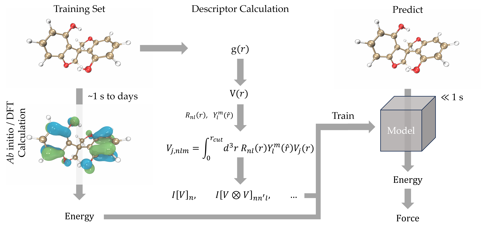
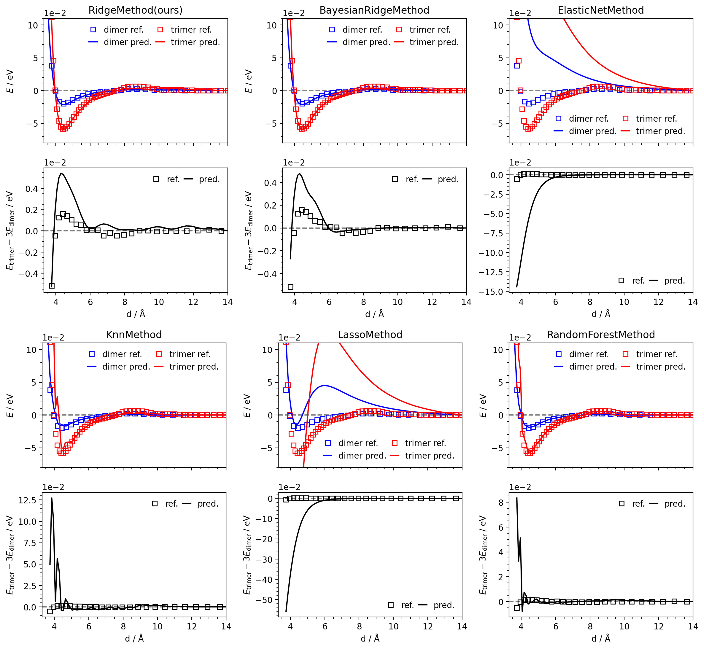

[](https://classroom.github.com/a/fEFF99tU)
[](https://classroom.github.com/online_ide?assignment_repo_id=12812552&assignment_repo_type=AssignmentRepo)

# EPFL Machine Learning (CS411) Project 2 `Machine Learning Forcefields (ML-FFs) from Spatial Equivariant Descriptors`

## Team members

- Pian Wan, pian.wan@epfl.ch
- Qianjun Xu, qianjun.xu@epfl.ch
- Siyuan Cheng, siyuan.cheng@epfl.ch


## Method


## Quickstart

### Requirements
```shell
git clone git@github.com:CS-433/ml-project-2-cross-entropy.git
cd ml-project-2-cross-entropy
pip install -r requirements.txt
```

### Datasets
You can access the dataset [here](https://github.com/CS-433/ml-project-2-cross-entropy/tree/main/dataset). Download all `.xyz` and `.npz` files and put them into `./dataset` folder. 

Because the dataset is small, we include all the datasets in the repository.

### Run
```shell
python train.py
```
### Results



## Project Organization


## Acknowledgements
The authors thank Philip Robin Loche and Kevin Kazuki Huguenin-Dumittan for their guidance and useful discussions.
